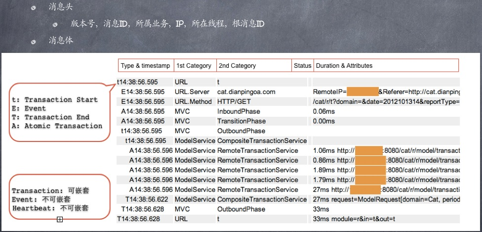

<h2>项目源码将于2024年9月开源公布</h2>

## 设计架构
jpOwl 客户端使用 Java 语言开发，旨在提供简洁的 API 和高可靠性，确保在各种业务场景下不会影响业务服务性能。目标是为各业务线提供全面的埋点功能和数据采集能力。

数据收集机制：
* **ThreadLocal：** 利用 ThreadLocal 为每个线程提供独立的副本，避免线程间的数据冲突。在执行业务逻辑时，将监控数据存储到 ThreadContext 中，它以树形结构组织监控信息。业务线程完成后，将监控对象异步地存入内存队列。jpOwl 使用消费者线程异步将数据发送到第三方存储引擎。

## 场景需求
1. **监控粒度控制：** 支持在接口、方法或代码块级别进行监控。
2. **异步处理：** 确保异步操作失败不会影响业务流程。
3. **注解与编程式使用：** 提供注解式和编程式两种使用方式。
4. **动态日志级别：** 日志级别可根据响应时间、失败次数和数据大小进行调整。
5. **自定义触发器：** 支持添加自定义触发器，以激活特定功能。
6. **动态记录前缀：** 监控日志内容的记录前缀可动态指定。
7. **支持多种输出源：** 支持内存、本地文件、MongoDB、Elasticsearch 等输出源。
8. **在线调整日志级别：** 支持在线修改日志记录级别。
9. **数据延迟上报：** 支持延迟上报监控数据或触发，便于聚合业务数据统计记录。
10. **监控数据统计与告警：** 支持秒级、分钟级的监控，配置告警策略（如钉钉、邮件、短信等），支持个性化业务指标的预计算和监控告警。

## 性能设计
1. **异步 I/O**  操作：优化 I/O 操作以提高性能。
2. **异步数据采集：使用 NIO**  管道进行日志记录，减少阻塞。 
3. **内存级缓冲：支持指定缓存队列大小，** 并采用内存队列安全机制，当队列填充至 80% 时，丢弃低优先级的日志（如 TRACE、DEBUG、INFO）。

## 价值与优势
**价值**
* **减少故障发现时间：** 实时获取和分析监控数据，缩短故障发现时间。
* **降低故障定位成本：** 提供全面的监控信息，帮助快速定位问题。
* **辅助应用程序优化：** 通过数据分析提供优化建议。
* **全量统计与预计算：** 支持全量数据统计，支持预计算以提升分析效率。

**优势**
* **实时处理：** 迅速处理信息，确保数据的时效性。
* **全量数据：** 支持全量采集和深度分析故障案例。
* **故障容忍：** 故障不会影响业务的正常运行，业务操作对监控透明。
* **高吞吐：** 高效处理大量监控数据，保证系统稳定性和性能。

## 业务模型监控
jpOwl主要支持以下四种监控模型：

* **Transaction**	适合记录跨越系统边界的程序访问行为,比如远程调用，数据库调用，也适合执行时间较长的业务逻辑监控，Transaction用来记录一段代码的执行时间和次数。
* **Event**	用来记录一件事发生的次数，比如记录系统异常，它和transaction相比缺少了时间的统计，开销比transaction要小。
* **Heartbeat**	表示程序内定期产生的统计信息, 如CPU利用率, 内存利用率, 连接池状态, 系统负载等。
* **Metric** 用于记录业务指标、指标可能包含对一个指标记录次数、记录平均值、记录总和，业务指标最低统计粒度为1分钟。

### 消息树
jpOwl监控系统将每次URL、Service的请求内部执行情况都封装为一个完整的消息树、消息树可能包括`Transaction`、`Event`、`Heartbeat`、`Metric`等信息。

### 可能的规划
1. **异步序列化：** 使用 Protobuf 协议进行高效的异步序列化。(适用跨语言支持的数据传输需求)
2. **异步通信：** 基于 Netty 实现异步 NIO 数据传输。 (适用应用程序到日志服务器的高效传输)

### gpt
我希望您充当 java领域架构师。技术水平跟springboot作者一样牛
我将提供有向你咨询关于框架项目开发的问题，我需要你给出答案或建议
给出的代码还要考虑到扩展性以及用设计模式优化，我的主要目的是自己
开发一款公司全业务项目通用的jar，所以代码要优雅和支持并发，明白了吗
